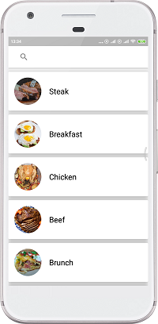
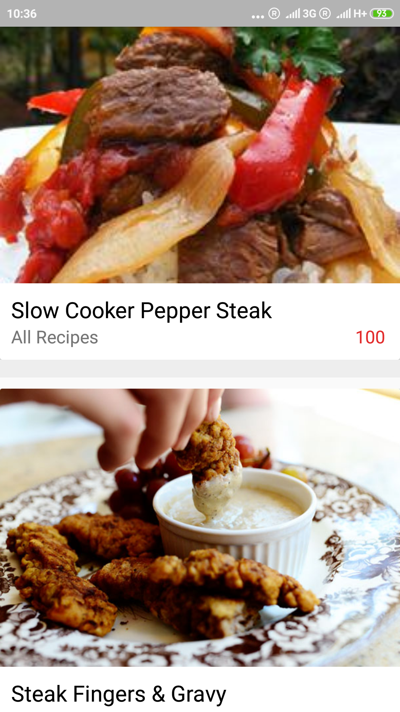
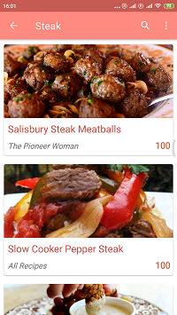
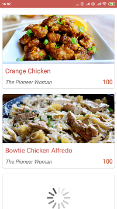
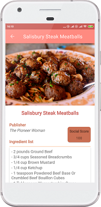
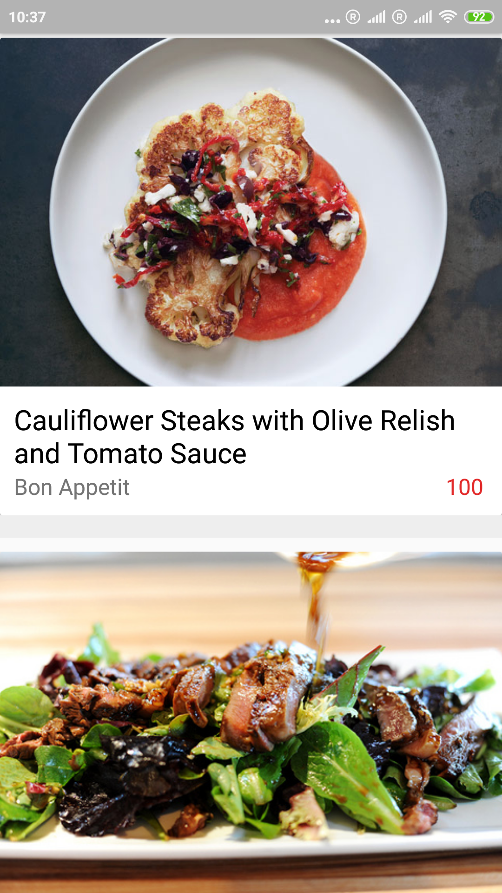

# Recipes Search Demo

Demo app for testing RestApi Calls.
A food recipe search app with retrofit, livedata and using android best practices.

The app is currently not being developed.
 
 
<h1>Screenshots</h1>

  

  
  
<h1>Libraries Used</h1>
  
Lifecycles- Create a UI that automatically responds to lifecycle events.

  
LiveData - Build data objects that notify views when the underlying database changes.

  
Room - Caching the network data for offline use.
 
  
ViewModel - Persist the data on configuration changes.

  
Glide - Image Loading.

  
Retrofit - Http Requests.

  
Gson - Convert Json objects.

  
Circle Imageview - Display images in a circle.

  
<h1>Non-Goals</h1>
The focus of this project was on HTTP requests and caching the data for offline use using the MVVM pattern.

The UI only was worked till the point were we can get and display the results less design time was spent.

<h1>App architecture</h1>
 

The app was developed taking in account the best practices and recommended architecture from Google for building apps.

