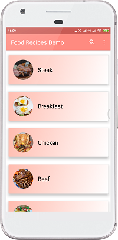
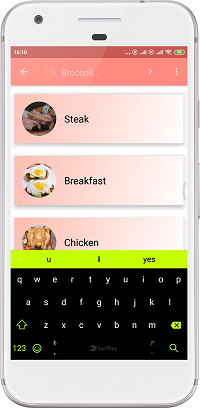
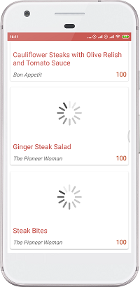

# Recipes Search Demo

Demo app for testing RestApi Calls.
A food recipe search app with retrofit, livedata and using android best practices.

The app is currently not being developed.
 
 
<h1>Screenshots
<table>
  <tr>
    <th>
      
      
      
    </th>
  </tr>
  <th>
    
    
    
  </th>
  
</table>
<h1>Libraries Used</h1>
  
Lifecycles

  
LiveData - Observe the data changes and make UI changes.

  
Room - Caching the network data for offline use.
 
  
ViewModel - Persist the data on configuration changes.

  
Glide - Image Loading.

  
Retrofit - Http Requests.

  
Gson - Convert Json objects.

  
Circle Imageview - Display images in a circle.

  
